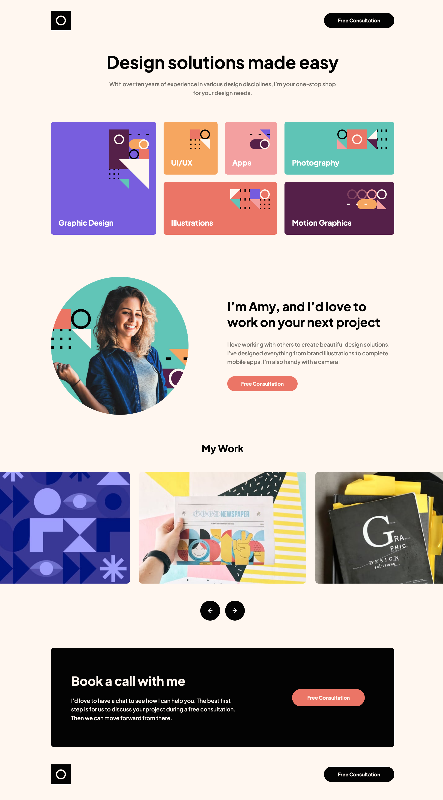

# Frontend Mentor - Single-page design portfolio solution

This is a solution to the [Single-page design portfolio challenge on Frontend Mentor](https://www.frontendmentor.io/challenges/singlepage-design-portfolio-2MMhyhfKVo). Frontend Mentor challenges help you improve your coding skills by building realistic projects. 

## Table of contents

- [Overview](#overview)
  - [The challenge](#the-challenge)
  - [Screenshot](#screenshot)
  - [Links](#links)
- [My process](#my-process)
  - [Built with](#built-with)
  - [What I learned](#what-i-learned)
  - [Continued development](#continued-development)
- [Author](#author)
- [Acknowledgments](#acknowledgments)

## Overview

### The challenge

Users should be able to:

- View the optimal layout for the site depending on their device's screen size
- See hover states for all interactive elements on the page
- Navigate the slider using either their mouse/trackpad or keyboard

### Screenshot

### Links

- Solution URL: [Github](https://github.com/kwonmoon/single-page-design-portfolio)
- Live Site URL: [Netlify]()

## My process

### Built with

- Semantic HTML5 markup
- CSS custom properties
- Flexbox
- CSS Grid
- Sass
- Javascript

### What I learned

It was a great pleasure to learn how to play with images and viewports using pure javascript. I didn't want to use any libraries since my goal is to learn how to do it by myself. I spent a lot of time to deal with images in the "My Work" section and it gave me a lot of satisfaction seeing the improvements step by step. To be honest with you, I got a lot of help from chatGPT. I didn't ask chatGPT to do the programming job for me since eventually I had to figure out to put pieces together to make it work the way I wanted. I googled a lot but my solution is a lot simpler and very easy to understand.

### Continued development

I will be devote more effort in javascript since it gave me a feeling of total control.

## Author

- Frontend Mentor - [@kwonmoon](https://www.frontendmentor.io/profile/kwonmoon)
- Twitter - [@kevin_moon_0830](https://www.twitter.com/kevin_moon_0830)

## Acknowledgments

- chatGPT, Youtube and Google